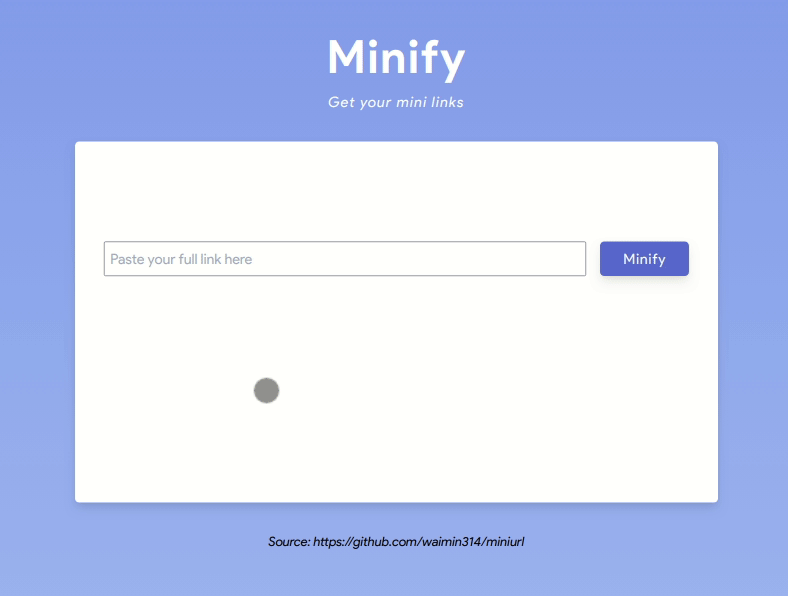
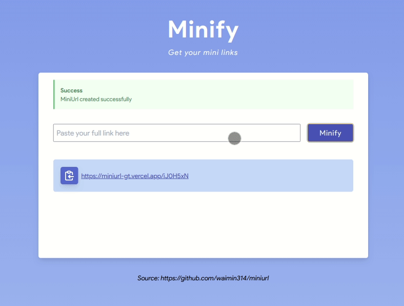
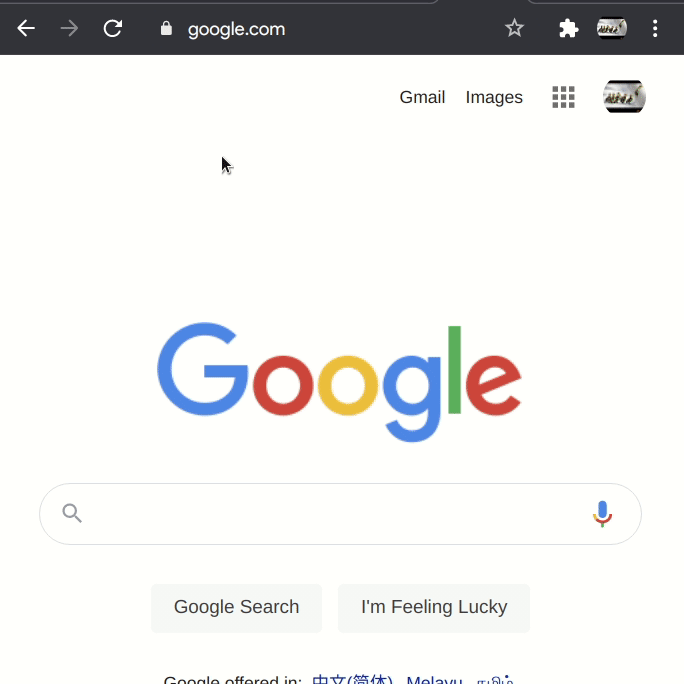

# Minify: Shorten you URLS

Demo: [miniurl-gt.vercel.app](https://miniurl-gt.vercel.app/)

### Features

#### 1. Minify your full links to share easily

#### 2. Copy to clipboard after creating a mini link

#### 3. Redirect from minified url to full url

### Development

#### 1. Tech stack

**Backend** => NodeJS + Express + mongoDB

**Front-End** => React, Create React App, TailwindCSS

#### 2. Setting up

1. Rename `.env-sample` to `.env`
2. Inside `env`, add the following
   a. `MONGODB_URI` => Your mongodb URI for saving and retrieving the urls
   b. `TEST_MONGODB_URI` => Mongodb URI for testing the server
   c. `HOMEPAGE_URL` => The base url of the client in development. By default, it is set to localhost:3000 as per CRA
   d. `HOMEPAGE_URL_PROD` => same as `HOMEPAGE_URL`, but for production mode. For example, in the demo above, it will be `https://miniurl-gt.vercel.app/`

3. Run `npm i` inside the main directory for server and inside **client** folder for client npm installation

#### 3. Available scripts

1. Inside the **main** folder
   
    **`npm start`**

    Starts `server.js` located inside **server** folder

    **`npm run server`**
    
    Runs `server.js` with **nodemon** for development

    **`npm run dev`**
    
    Launches both **client** and **server** simultaneously

    **`npm test`**
    
    Runs the tests inside **server** folder

2. Inside the **client** folder
   
    **`npm start`**
    
    Starts the client in development mode

    **`npm run build`**
    
    Builds the app for production to the **build** folder

    **`npm test`**
    
    Runs the client tests